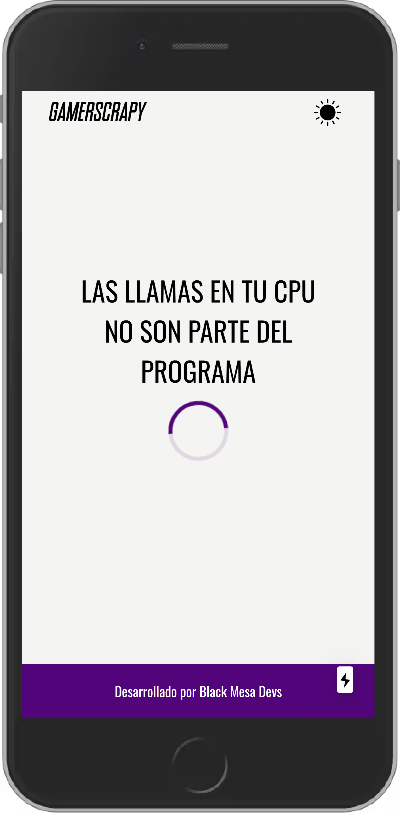
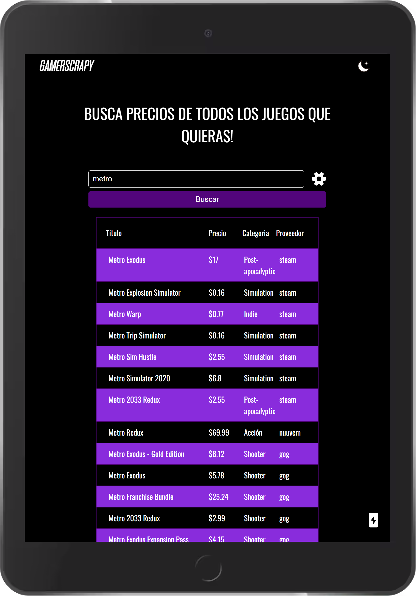

### Como levantarlo en Local

Requisito NodeJS https://nodejs.org/es/

comandos 




## Dependencias
Primera vez para instalar dependencia

``` npm install ```

## Para correr local

``` npm run dev```
